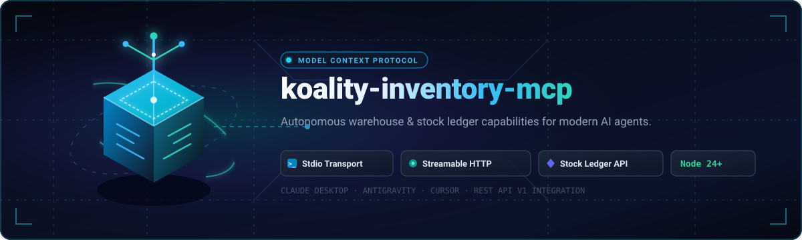

<div align="center">



<br /><br />


# koality-inventory-mcp

**High-assurance Model Context Protocol (MCP) server exposing warehouse stock ledger capabilities to autonomous AI agents.**

[](https://github.com/Koality-Assured/koality-inventory-mcp/actions/workflows/ci.yml)
[](https://github.com/Koality-Assured/koality-inventory-mcp/blob/main/LICENSE)
[](https://modelcontextprotocol.io/)
[](https://nodejs.org/)

</div>

---

## Overview

`koality-inventory-mcp` is a standalone Model Context Protocol server that bridges autonomous AI assistants—such as **Claude Desktop**, **Antigravity**, **Cursor**, and automated multi-agent orchestrators—with the [`koality-inventory`](https://github.com/Koality-Assured/koality-inventory) warehouse and inventory platform.

By translating standard MCP tool invocations into authenticated, type-safe REST calls against the `koality-inventory` API, autonomous agents can safely inspect item masters, query real-time stock balances across warehouse bins, post auditable adjustments, manage bin-to-bin transfers, and execute procurement and blind cycle-counting workflows.

---

## Architecture

The MCP server acts as an isolation gateway between conversational host environments and the backend inventory ledger:

```mermaid
flowchart LR
    subgraph Hosts["AI Agent Hosts"]
      Claude["Claude Desktop"]
      AGY["Antigravity Agent"]
      Cursor["Cursor IDE"]
    end

    subgraph MCP["koality-inventory-mcp Server"]
      direction TB
      Stdio["Stdio Transport<br/>(stdin / stdout)"]
      StreamHTTP["Streamable HTTP<br/>(Remote Clusters)"]
      Dispatcher["MCP Tool Dispatcher<br/>(Zod Validation &amp; Schema Registry)"]
      Client["InventoryClient<br/>(Bearer Auth &amp; REST Adapter)"]

      Stdio --> Dispatcher
      StreamHTTP --> Dispatcher
      Dispatcher --> Client
    end

    subgraph Core["koality-inventory Platform"]
      API["REST API (/api/v1)<br/>(Port 3000)"]
      DB[("Dual-Dialect DB<br/>SQLite / PostgreSQL")]
      API --> DB
    end

    Hosts -->|Process IPC (JSON-RPC)| Stdio
    Hosts -.->|Streaming HTTP| StreamHTTP
    Client -->|HTTP / JSON (Bearer Token)| API
```

---

## Transports Architecture

`koality-inventory-mcp` enforces a modern, clean transport boundary per the Model Context Protocol specification:

| Transport             |           Status            | Target Deployment          | Description                                                                                                                                                                                                                                                       |
| :-------------------- | :-------------------------: | :------------------------- | :---------------------------------------------------------------------------------------------------------------------------------------------------------------------------------------------------------------------------------------------------------------- |
| **`stdio`**           |       **Production**        | Local Workstations & CLI   | Standard I/O process communication over `stdin`/`stdout`. Zero network attack surface; ideal for desktop clients (Claude Desktop, Cursor, Antigravity) running on the same host.                                                                                  |
| **`streamable-http`** |   **Architecture Target**   | Remote Enterprise Clusters | High-throughput, firewall-friendly single-endpoint streaming HTTP for remote agent swarms and Kubernetes clusters. Supported transport target defined in transport validation.                                                                                    |
| **`http+sse`**        | ❌ **Deprecated / Blocked** | _None_                     | **Intentionally not implemented.** The legacy MCP dual-connection pattern (separate SSE stream and HTTP POST endpoint) introduces state desynchronization and firewall traversal vulnerabilities. The server rejects `sse`, `http+sse`, and `http-sse` at launch. |

---

## Tool Reference

The server exposes 9 strongly-typed tools validated with Zod schemas.

### Core Stock Ledger Tools

| Tool Name              | Parameters                                                                | Type                                                                                                                   | Description                                                                                                                                               | Safety Guardrail                                                                                            |
| :--------------------- | :------------------------------------------------------------------------ | :--------------------------------------------------------------------------------------------------------------------- | :-------------------------------------------------------------------------------------------------------------------------------------------------------- | :---------------------------------------------------------------------------------------------------------- |
| `stock_get_balance`    | `skuId`<br>`locationId`                                                   | `string` (required)<br>`string` (optional)                                                                             | Queries real-time on-hand, allocated, available-to-promise (ATP), and in-transit quantities for a given SKU. Pass `locationId` to filter to a single bin. | **Read-Only**.<br>Safe for unconstrained model exploration; returns current balance snapshot.               |
| `stock_search_catalog` | `query`                                                                   | `string` (required)                                                                                                    | Performs substring and semantic search across the item master, product names, and SKU catalog.                                                            | **Read-Only**.<br>URL-encoded query parameter; returns matching item catalog records.                       |
| `stock_adjust`         | `skuId`<br>`locationId`<br>`quantityDelta`<br>`reason`<br>`unitCostCents` | `string` (required)<br>`string` (required)<br>`integer` (required)<br>`string` (required)<br>`integer >= 0` (optional) | Posts an inventory ledger adjustment. Positive deltas increment on-hand stock; negative deltas decrement on-hand stock.                                   | **Mutating**.<br>Requires an explicit audit reason and verified location ID to prevent untracked shrinkage. |
| `stock_transfer`       | `skuId`<br>`fromLocationId`<br>`toLocationId`<br>`quantity`               | `string` (required)<br>`string` (required)<br>`string` (required)<br>`integer > 0` (required)                          | Moves on-hand inventory from a source bin into in-transit status toward a destination bin.                                                                | **Mutating**.<br>Quantity must be positive; source and destination bins must be distinct.                   |

### Procurement & Cycle Count Tools

| Tool Name                       | Parameters                            | Type                                                                           | Description                                                                                                                       | Safety Guardrail                                                                                                  |
| :------------------------------ | :------------------------------------ | :----------------------------------------------------------------------------- | :-------------------------------------------------------------------------------------------------------------------------------- | :---------------------------------------------------------------------------------------------------------------- |
| `stock_reorder_recommendations` | _(none)_                              | `{}`                                                                           | Computes replenishment recommendations for items whose Available-to-Promise (ATP) has fallen at or below their reorder threshold. | **Read-Only**.<br>Pure analytical advisory; generates purchasing suggestions without placing orders.              |
| `stock_create_purchase_order`   | `vendorId`<br>`lines`                 | `string` (required)<br>`Array<{ skuId, locationId, quantity, unitCostCents }>` | Drafts a formal Purchase Order for a specified vendor with line items and unit costs.                                             | **Mutating**.<br>Creates PO in draft state; line quantities must be positive integers and unit cost non-negative. |
| `stock_receive_shipment`        | `poId`<br>`lineId`<br>`quantity`      | `string` (required)<br>`string` (required)<br>`integer > 0` (required)         | Receives inventory against an approved purchase order line, incrementing on-hand stock and clearing in-transit balances.          | **Mutating**.<br>Validates against open PO line constraints to prevent over-receiving.                            |
| `stock_start_cycle_count`       | `locationId`<br>`skuIds`              | `string` (required)<br>`string[]` (required)                                   | Initiates a blind inventory cycle count for specified SKUs at a given warehouse location.                                         | **Mutating**.<br>Blind audit protocol: hides system quantities from counting agents to ensure audit integrity.    |
| `stock_record_count`            | `cycleId`<br>`lineId`<br>`countedQty` | `string` (required)<br>`string` (required)<br>`integer >= 0` (required)        | Submits the physically counted quantity for an active cycle count line to calculate variance.                                     | **Mutating**.<br>Requires valid cycle session; accepts non-negative count values.                                 |

---

## Configuration & Agent Setup

### Environment Variables

Configure connection details for the target `koality-inventory` API:

| Variable                    | Default                 | Description                                                                  |
| :-------------------------- | :---------------------- | :--------------------------------------------------------------------------- |
| `KOALITY_INVENTORY_API_URL` | `http://127.0.0.1:3000` | Base URL of the running `koality-inventory` REST API service.                |
| `KOALITY_INVENTORY_TOKEN`   | `""`                    | Bearer authorization token passed in `Authorization: Bearer <token>` header. |

### Running Locally (Stdio)

```bash
# Build the TypeScript project
npm run build

# Run via environment variables
export KOALITY_INVENTORY_API_URL="http://127.0.0.1:3000"
export KOALITY_INVENTORY_TOKEN="your-access-token"
node dist/main.js
```

### Claude Desktop Integration

Add `koality-inventory-mcp` to your Claude Desktop configuration file:

- **macOS**: `~/Library/Application Support/Claude/claude_desktop_config.json`
- **Windows**: `%APPDATA%\Claude\claude_desktop_config.json`

```json
{
  "mcpServers": {
    "koality-inventory": {
      "command": "node",
      "args": ["C:/Code/KA/koality-inventory-mcp/dist/main.js"],
      "env": {
        "KOALITY_INVENTORY_API_URL": "http://127.0.0.1:3000",
        "KOALITY_INVENTORY_TOKEN": "your-access-token"
      }
    }
  }
}
```

> **Development Mode**: You can also point directly to `tsx` during development without rebuilding:
>
> ```json
> {
>   "command": "npx",
>   "args": ["-y", "tsx", "C:/Code/KA/koality-inventory-mcp/src/main.ts"]
> }
> ```

---

## Development & Verification

This project targets Node.js 24+ and requires strict type-checking and automated test verification.

```bash
# Install dependencies
npm ci

# Run test suite with Vitest
npm test

# Static analysis and verification
npm run lint
npm run format:check
npm run typecheck

# Build to dist/
npm run build
```

---

## License

This project is licensed under the [MIT License](./LICENSE).
